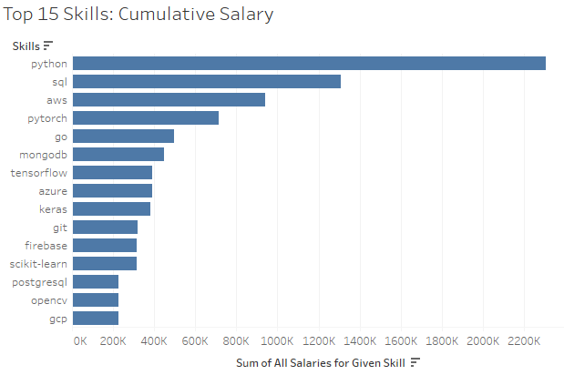

# Introduction
This project is a deep dive into the job market in Germany (2023). The analysis focuses on senior roles (i.e., Data Science, AI/ML, Analyst, Engineer, etc.) and explores top paying jobs, in-demand skills, and where high demand meets high salary for senior roles.

SQL queries? Check them out here: [project_sql_folder](/project_sql/)

# Background
This project is an adjusted version of the [*SQL for Data Analytics*](https://www.youtube.com/watch?v=7mz73uXD9DA&t=10257s) by Luke Barousse. This project has insights on job titles, salaries, and essential skills.

### The questions I wanted to answer through my queries are:
1. What are the top-paying "senior" role jobs?
2. What skills are required for these top-paying jobs?
3. What skills are the most in demand for "senior" roles?
4. Which skills are associated with higher salaries?
5. What are the most optimal skills to learn/develop?

# Tools I Used
For my deep dive into the senior data-related role job market, I applied the power of several key tools:

- **SQL**: Backbone of my analysis, allowing me to query the database and get insights.
- **PostgreSQL**: The chosen database management syste, ideal for handing the job posting data.
- **Visual Studio Code**: Preffered IDE for database management and executing SQL queries.
- **Git & GitHub**: Used for version control and sharing my SQL scripts, ensuring project tracking.
- **Tableau Public**: Used primarily for data visualisations.

# The Analysis
Each query for this prokect aimed at investigating specific highest-paying roles, I filtered data analyst positions by averaging yearly salary and locaton, focusing on remote jobs. This query highlights the high paying opportunities in the field.

## 1. Top Paying Senior Data-Roles
I want to find the top paying data-related jobs in Germany with experience. Therefore, I filtered the data to look for the word "Senior" regardless of the type of role. I also filtered the data to match for "Germany" regardless of the city. Once empty values were removed, the data was sorted by salary.

```sql
SELECT
    job_id,
    job_title,
    job_location,
    job_schedule_type,
    salary_year_avg,
    job_posted_date,
    company_dim.name AS company_name
FROM job_postings_fact
LEFT JOIN company_dim ON job_postings_fact.company_id = company_dim.company_id
WHERE 
    job_title LIKE '%Senior%' AND
    job_location LIKE '%Germany' AND -- Find roles in any location in Germany 
    salary_year_avg IS NOT NULL
ORDER BY salary_year_avg DESC
LIMIT 10;
```
Here is a breakdown of the top paying senior roles in the data field in 2023:
- **Rise of AI:** The highest-paying roles were consistently in Machine Learning, AI Research, and Data Science. Eight out of the top 10 postings were Machine Learning/Ai-specific. Only two posts were for Data Analytics (Consulting and Engineer, respectively).
- **Economic Powerhubs:** Six of the top 10 highly paid positions were located in Berlin, while two were located in economic powerhouses such as Frankfurt and Munich. Only 3 postings were from non-large population centers.
- **Paid for experience:** Salaries ranged from about $150,000 to $225,000. The top two roles (both paying $224,500) were AI/ML-focused positions at Worldcoin, indicating strong market demand for specialized AI talent.

## 2. Top Paying Skills
To find the highest paid skills in Germany, the same filters as before were used. However, this information was combined the skills table.


```sql
WITH top_paying_jobs AS (
    SELECT
        job_id,
        job_title,
        salary_year_avg,
        name AS company_name
    FROM job_postings_fact
    LEFT JOIN company_dim ON job_postings_fact.company_id = company_dim.company_id
    WHERE 
        job_title LIKE '%Senior%' AND
        job_location LIKE '%Germany' AND 
        salary_year_avg IS NOT NULL
    ORDER BY salary_year_avg DESC
    LIMIT 15 -- Changed it to top 15 in the filter because we lose data from the inner join
    )

SELECT 
    top_paying_jobs.*,
    skills
FROM top_paying_jobs
INNER JOIN skills_job_dim ON top_paying_jobs.job_id = skills_job_dim.job_id 
INNER JOIN skills_dim ON skills_job_dim.skill_id = skills_dim.skill_id
ORDER BY salary_year_avg DESC;
```
<br>

The data visualisation below shows the top 15 highest average salaries for a job post. According to the data, specialized skills such as rust, postgres, opencv, mongodb and gcp pay the highest. Meanwhile, more common skills such as python/pytorch are also in the top 15.


- **Outlier Problem**: There is a major weakness to such visualisation: certain job posts are outliers because they required specialized knowledge; they pay more for hyper-specific skills. This is not conclusive to what skills are needed for senior roles nor is it informative of which skills to learn. 

Another alternative is to visualize the cumulative salaries per skill; the more job postings in the top 15 that want certain skills, the higher the skill's total value. 



This shows what I expected from the beginning: skills such as Python and SQL are highly valuable, and the following skills are representative of what is required for most Machine Learning and AI roles.

## 3. Highest Demanded Skills
To check my work, I queried the data to retrieve the top 5 skills by count.
```sql
SELECT 
    skills,
    COUNT(skills_job_dim.job_id) AS demand_count
FROM job_postings_fact
INNER JOIN skills_job_dim ON job_postings_fact.job_id = skills_job_dim.job_id 
INNER JOIN skills_dim ON skills_job_dim.skill_id = skills_dim.skill_id
WHERE
    job_title LIKE '%Senior%' AND
    job_location LIKE '%Germany'  
GROUP BY skills
ORDER BY demand_count DESC
LIMIT 5;
```
The cumulative visualisation is somewhat corroborated by the output:

| Skills   | Demand Count |
|----------|--------------|
| python   | 3319         |
| sql      | 2633         |
| aws      | 1405         |
| azure    | 1139         |
| spark    | 1008         |
- **Python & SQL** are mandatory. 
- **AWS & Spark** jumps to 3rd and 5th most saught after skill respectively.
- **Azure** is still valuable.

### All Data-Related Jobs
- Further corroborates that Python and SQL are highly saught after at any level.
-  **R and Azure** play a bigger role when looking at all data-related job postings.

| Skills   | Demand Count |
|--------|--------------|
| python | 12927        |
| sql    | 10506        |
| azure  | 4407         |
| r      | 4109         |
| aws    | 3912         |

### Side-Track: Top 5 Data-Related Skills (Berlin)

<div style="display: flex; gap: 40px; align-items: flex-start;">
  <div>
    <strong>All Roles</strong>
    <table>
      <tr><th>Skills</th><th>Demand Count</th></tr>
      <tr><td>python</td><td>2727</td></tr>
      <tr><td>sql</td><td>2383</td></tr>
      <tr><td>aws</td><td>1062</td></tr>
      <tr><td>tableau</td><td>845</td></tr>
      <tr><td>airflow</td><td>687</td></tr>
    </table>
  </div>
  <div>
    <strong>Senior roles</strong>
    <table>
      <tr><th>Skills</th><th>Demand Count</th></tr>
      <tr><td>python</td><td>1037</td></tr>
      <tr><td>sql</td><td>905</td></tr>
      <tr><td>aws</td><td>491</td></tr>
      <tr><td>spark</td><td>331</td></tr>
      <tr><td>airflow</td><td>322</td></tr>
    </table>
  </div>
</div>   

- **Python, SQL, and AWS** are top 3 skills in Berlin.
- **Spark and Airflow** for more senior roles.
- **Tableau** for all roles, not just senior roles.

## 4. Skills Based on Salary
Exploring the average salaries associated with different skills revealed which skills are the highest paying.
```sql
SELECT 
    skills,
    ROUND(AVG(job_postings_fact.salary_year_avg),0) AS skill_pay_avg
FROM job_postings_fact
INNER JOIN skills_job_dim ON job_postings_fact.job_id = skills_job_dim.job_id 
INNER JOIN skills_dim ON skills_job_dim.skill_id = skills_dim.skill_id
WHERE
    job_title LIKE '%Senior%' AND
    job_location LIKE '%Germany' AND 
    salary_year_avg IS NOT NULL
GROUP BY skills
ORDER BY skill_pay_avg DESC
LIMIT 25;
```
Here's a breakdown of the results for top paying skills for senior data-related roles:
- **High Pay for Big Data & ML Skills** Top salaries are for specialized senior roles (Rust, OpenCV), machine learning tools (Tensorflow, NLTK), and Python libraries (Pandas, NumPy), reflecting the industry's high valuation of data processing and predictive modeling capabilities.
- **Data Analysis/Less-High Code Roles** Even with in the top 25 skills for senior roles, less techincal skills are paid less on average (e.g., slack, zoom, jira)

| Skills       | Average Salary ($) |
|--------------|---------------|
| rust         | 224500        |
| mongodb      | 224500        |
| opencv       | 224500        |
| keras        | 191000        |
| tensorflow   | 182667        |
| postgresql   | 179000        |
| pytorch      | 178500        |
| hadoop       | 161125        |
| firebase     | 158500        |
| numpy        | 157500        |
| nosql        | 157500        |
| nltk         | 157500        |
| airflow      | 153192        |
| oracle       | 152500        |
| pandas       | 152500        |
| kafka        | 152500        |
| scikit-learn | 152500        |
| gcp          | 151933        |
| jira         | 151500        |
| matplotlib   | 147500        |
| jupyter      | 147500        |
| cassandra    | 147500        |
| gdp          | 147500        |
| slack        | 147500        |
| zoom         | 147500        |

*Table of the average salary for the top 25 paying skills for senior data related roles*

## 5. Most Optimal Skills to Learn
Combining insights from demand and salary data, this query aimed to pinpoint skills that are both in high demand and have high salaries, offering a strategic focus for skill development.
```sql
SELECT
    skills_dim.skill_id,
    skills_dim.skills,
    COUNT(skills_job_dim.job_id) AS demand_count,
    ROUND(AVG(job_postings_fact.salary_year_avg),0) AS avg_salary
FROM job_postings_fact
INNER JOIN skills_job_dim ON job_postings_fact.job_id = skills_job_dim.job_id 
INNER JOIN skills_dim ON skills_job_dim.skill_id = skills_dim.skill_id
WHERE
    job_title LIKE '%Senior%' AND    
    salary_year_avg IS NOT NULL AND
    job_location LIKE '%Germany' 
GROUP BY skills_dim.skill_id
HAVING
    COUNT(skills_job_dim.job_id) > 5
ORDER BY
    avg_salary DESC,
    demand_count DESC
LIMIT 25;
```
| Skill ID | Skills     | Demand Count | Average Salary ($) |
|----------|------------|--------------|------------|
| 96       | airflow    | 13           | 153192     |
| 98       | kafka      | 8            | 152500     |
| 81       | gcp        | 6            | 151933     |
| 1        | python     | 41           | 146325     |
| 210      | git        | 8            | 141159     |
| 75       | databricks | 8            | 141138     |
| 92       | spark      | 20           | 140920     |
| 77       | bigquery   | 7            | 140868     |
| 78       | redshift   | 10           | 139850     |
| 74       | azure      | 15           | 139305     |

*Table of the most optimal skills for data analyst sorted by salary*

Removing any outliers (i.e. less than 5 postings per skill), here's a breakdown of the most optimal skills for "Senior" data-related roles in 2023:

- **High Technical Expertise = High Pay**: All of the skills are traditionally more orietened towards Data Engineer and Data Science rather than Data Analysis.
- **Cloud Tools and Technologies**: Skills in specialized technologies such as Azure, GCP, Redshift, and BigQuery show significant demand with relatively high average salaries, pointing towards the growing importance of cloud platforms and big data technologies in data analysis.
- **Big Data Processing**: Skills such as Databricks and especially Spark are very sought after and highly paid.
- **Workflow Automation and Data Pipelines**: Airflow has the highest salary and modest demand count.

# What I learned
- **Complex Query Crafting**: Refreshed on existing knowledge on SQL by applying it to a personal project.
- **Database Management**: Learned how to create databases and populate databases, create tables within the database, and various SQL functions and commands.
- **Technical Skill Landscape**: Analysed and determined what skills are well saught after for senior roles as well as which types of senior roles have the highest return on investment.


# Conclusions
### Insights
This project provided a comprehensive analysis of the senior data-related job market in Germany in 2023. By examining top-paying roles, in-demand skills, and the intersection of high salary and skill demand, several key insights emerged:

1. **AI and Machine Learning dominance**: Senior roles in AI/ML, particularly in specialized fields, offer the highest salaries.

2. **Python, SQL, and Cloud Skills**: Python and SQL remain essential across nearly all senior roles, while expertise in cloud platforms (AWS, Azure, GCP) and big data tools (Spark, Airflow) also drive high pay.

3. **Skill Strategy**: The optimal skills to focus on include cloud technologies, big data processing, and workflow automation, providing a strategic roadmap for career advancement in the field.

This analysis highlights the importance of both technical proficiency and staying up-to-date with the latest industry trends to secure high-paying senior roles in the data sector.

### Closing Thoughts
This project filled in gaps in my SQL skills and provided valuable insights into what a senior role looks like. The findings from the analysis provide guidance the skills I should learn and/or develop next on my journey. This exploration also highlights the importance of learning new skills especially to emerging technological trends. I would be open to doing this project again with updated data as some of the specialised senior skills are already outdated by the time I am writing this in 2026. 